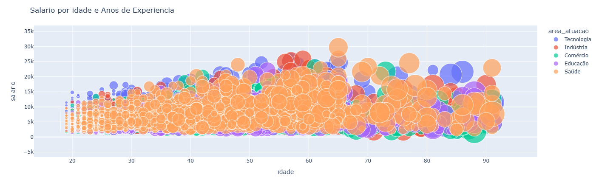

# 📊 Dashboard Interativo — Análise de E-commerce

<p align="center">
  
</p>

_____________________________________________________________________________________________________________________________________________
# Sobre o projeto

Este projeto consiste em um dashboard interativo desenvolvido em **Python** utilizando **Dash** e **Plotly**, com o objetivo de explorar dados de um e-commerce por meio de visualizações dinâmicas.

O dashboard apresenta indicadores e gráficos que permitem analisar preços, avaliações, quantidade de vendas e características dos produtos, facilitando a identificação de padrões e apoiando a tomada de decisões baseadas em dados.

_____________________________________________________________________________________________________________________________________________

# Objetivos

- Analisar o comportamento dos produtos vendidos.
- Explorar preços e avaliações.
- Identificar padrões de vendas.
- Comparar categorias e gêneros.
- Desenvolver um dashboard interativo em Python.

_____________________________________________________________________________________________________________________________________________

# Indicadores

- Quantidade de Produtos
- Média de Preços
- Média das Avaliações
- Quantidade de Vendas

_____________________________________________________________________________________________________________________________________________

# Visualizações

- Histograma de Preços
- Gráfico de Dispersão (Preço × Avaliação)
- Boxplot por Gênero
- Gráfico de Barras
- Dashboard Interativo

_____________________________________________________________________________________________________________________________________________

# Ferramentas utilizadas

- Python
- Pandas
- Dash
- Plotly Express
- Plotly Graph Objects

_____________________________________________________________________________________________________________________________________________

# Como executar

Clone o repositório:

```bash
git clone https://github.com/stedemoraes-source/dashboard-ecommerce-dash.git
```

Instale as dependências:

```bash
pip install -r requirements.txt
```

Execute o projeto:

```bash
python atividade_proj_3.py
```

_____________________________________________________________________________________________________________________________________________

# Resultado

Dashboard interativo desenvolvido para análise exploratória de dados de um e-commerce, permitindo a navegação pelos principais indicadores e gráficos de forma dinâmica.

_____________________________________________________________________________________________________________________________________________

# Desenvolvido por
Stéphanie Moraes Rosa

Data Analytics Portfolio
